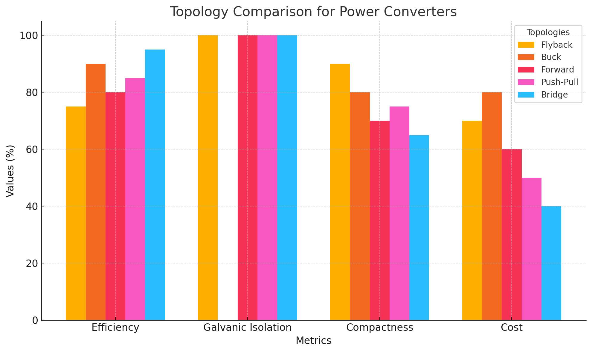
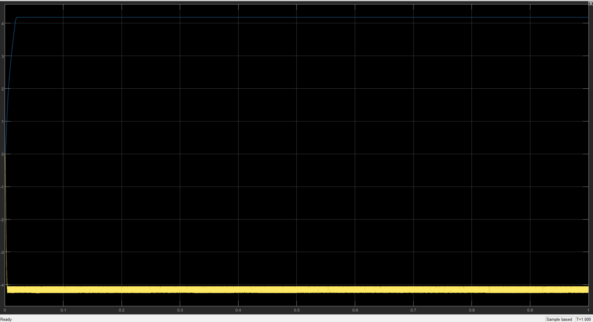
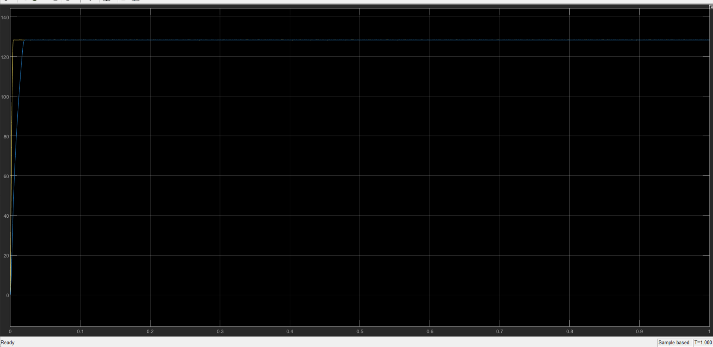
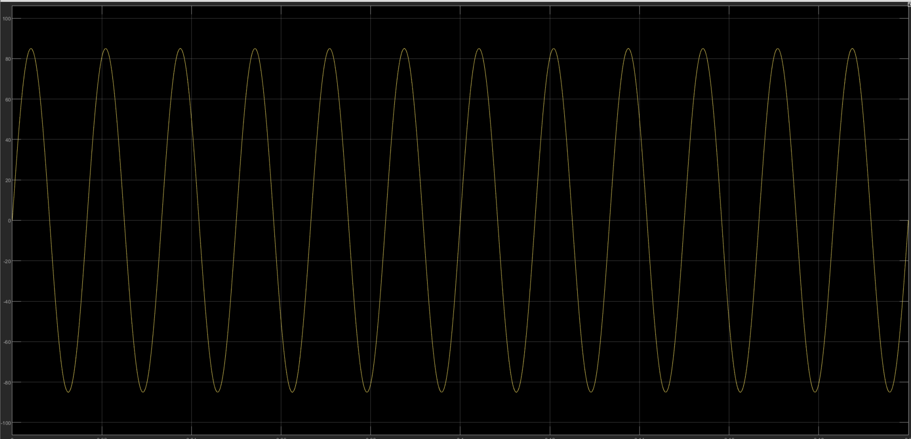
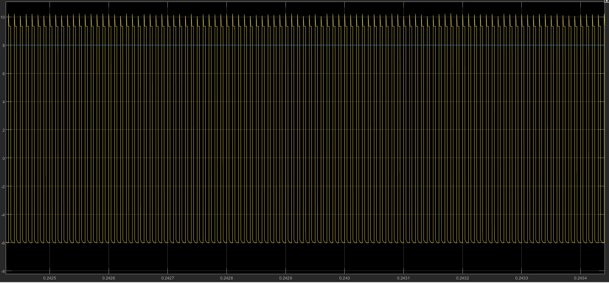

# Robotics & Machine Learning

> Isolated 5V/30W flyback power supply designed and simulated for phone charging

       



### 🌐 Live project page → **https://selsaady1.github.io/egr494-robotics-ml/**

## Overview
An EGR494 power electronics project (ASU, the course instructor) by a teammate and Saif Elsaady to design an isolated AC-DC power supply for cellphone charging. The supply targets a regulated 5V DC output at 30W from a universal single-phase AC input of 85V to 265V RMS at 60 Hz, with galvanic isolation between input and output for safety. A flyback converter topology was selected, sized through hand calculations, and verified in circuit simulation. Despite the repository name, the deliverables document a power-supply design project rather than a robotics or ML one.

**Highlight:** 75.65% simulated efficiency at 5V/30W

**Highlight:** 75.65% simulated efficiency at 5V/30W

## Key Achievements
- Selected and justified a flyback converter topology against buck, forward, push-pull, and bridge alternatives for a 30W isolated low-power design
- Designed a custom transformer with a 40:1 turns ratio and 34,000 uH inductance operating at roughly 60 kHz switching frequency
- Performed voltage and current stress calculations to select real parts (e.g. a 650V MOSFET, 200V rectifier diode, 470uF/400V input and 1,000uF output capacitors) sourced via Digikey/Mouser
- Simulated the converter to a steady 4.79V output with light ripple across the full input range
- Computed a full loss breakdown (diode 4.2W, copper 3.61W, MOSFET 1.63W, core 0.225W; 9.665W total) to characterize efficiency
- Delivered a full technical report and a 17-slide presentation, and proposed GaN switches and soft-switching as future efficiency improvements

## Approach
The team followed a systematic design methodology: topology selection and justification, key specification definition, transformer turns-ratio and inductance design, component stress analysis and sourcing, and circuit simulation for verification. Calculations were carried out analytically and the converter was modeled and simulated to capture input, transformer secondary, and output waveforms. Loss and efficiency estimation was then used to evaluate the design and identify optimization opportunities.

## Tools & Technologies
- MATLAB/Simulink
- LTspice
- Texas Instruments Power Stage Designer
- Digikey
- Mouser
- Microsoft Word
- Microsoft PowerPoint

## Gallery





## Repository Structure
```
.gitignore
.nojekyll
LICENSE
README.md
docs/EGR494 Cheat sheet.docx
docs/EGR494 Presentation .pptx
docs/EGR494 Project.docx
docs/EGR494 Report.docx
docs/TEST1_EGR494.docx
docs/TEST2_EGR494.docx
images/fig1.png
images/fig2.png
images/fig3.png
images/fig4.png
images/fig5.png
images/fig6.png
index.html
```

## Results
Simulation verified a regulated output (steady 4.79V, ripple under 50mV) across the 85-265V RMS input range, with an estimated overall efficiency of 75.65% and an 8.86% current ripple against 9.665W total losses. Full design detail and waveforms are in docs/EGR494 Report.docx and the accompanying presentation.

## Deliverable
See [`docs/EGR494 Report.docx`](docs/EGR494%20Report.docx).

## License
MIT — see [`LICENSE`](LICENSE).

---
_Part of [Saif Elsaady's engineering portfolio](https://selsaady1.github.io/portfolio/). Deliverables only — routine homework/quizzes/exams excluded._